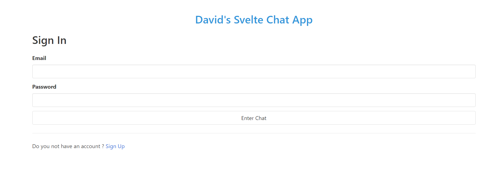
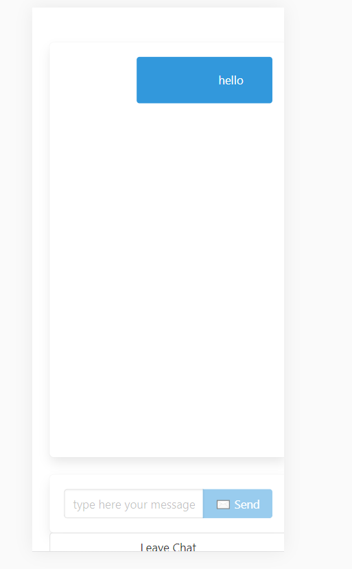

# svelte-chat-app

I did this project because I wanted more practice with Svelte and because I wanted to work with Firebase Authentication. I enjoyed this project a lot and it only took me a day and a half to complete. 

# Environment Setup 

1. Clone my repo at https://github.com/davidmstanleyjr/svelte-chat-app

2. CD into it and run "npm install" to install all of the dependencies.

# Technologies Used

1. HTML
2. CSS 
3. JavaScript
4. Svelte
5. Firebase
6. Sveltefire

# Issues

Like I said, i really enjoyed this project. However, i did have issues with it. The first issue is that after creating the files that I was going to use and writing a bit of code, nothing would render onto the page. I later realized that I wasn't importing all of the pages that I needed to be importing. 

Setting up everything on the firebase side wasn't complicated but it was a few extra steps that i'm not really used to. I didn't mind it tho because I prefer Firebase over MongoDB.

The sign in and sign out language was kinda complicated because i've never done it before, but I figured it out.

# Screenshots

# Live Page

Here is a link to the deployed site. I hope you have fun with it. 

https://davids-svelte-chat.netlify.app/
